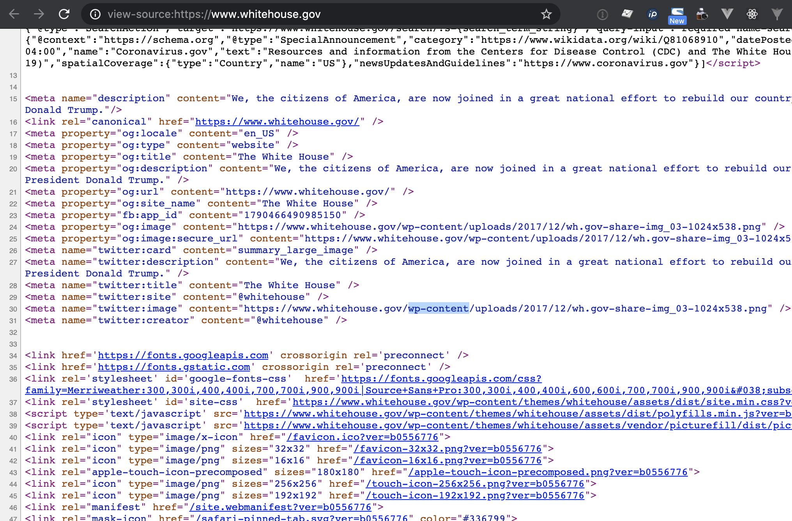
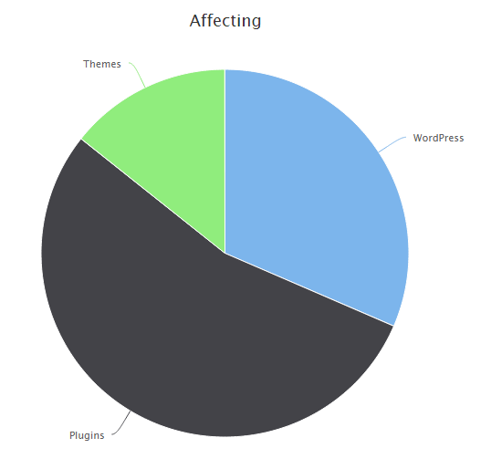

Segurança no WordPress
===============

> O site da casa branca a usar WordPress.

O WordPress publica a cada 3-4 meses actualizações do core do WordPress e no caso de incidentes críticos as correcções são disponibilizadas de imediato. Dado o uso crescente da utilização do WordPress tem havido cada vez mais especialistas a declarar o WordPress como um CMS capaz para se implementar os mais altos níveis de segurança.

A segurança do seu site é um assunto que deve ser encarado com extrema importância e ser levado muito a sério. Ao termos um site online estamos **sempre sujeitos a um elevado número de possíveis ataques e ocorrências**, sejam tentativas de intrusão no servidor, exploração de falhas de segurança na programação do site ou no WordPress, ataques de spammers, entre outros. 

Para proteger os sites contra estes ataques é preciso tomar **várias medidas**: desde fazer as actualizações ao WordPress (core + plugins + temas), instalação de todas as atualizações de segurança que sejam lançadas (normalmente automáticas), backups da base de dados, instalação de ferramentas de controlo e monitorização, e outras. Nesta página vou falar de algumas acções que podem ser tomadas e seguir estas recomendações irá aumentar o nível de protecção do seu site. A segurança é feita por camadas e cada acção adicional irá aumentar o nível de segurança.

Começemos no entanto por analisar a origem da maioria dos problemas de segurança em sites WordPress através desta imagem:

> Fonte: WPWhiteSecurity, Abril 2019

A maioria dos problemas ocorre em plugins (muitas vezes desactualizados) seguido do WordPress core (quando desatualizado) e por fim em temas (também muitas vezes desatualizados). Por esta razão a regra de ouro é manter sempre o *core+plugins+temas* atualizados. A segunda regra de ouro é escolher bem os plugins e temas com que trabalha. Veja [como escolher temas e plugins aqui](https://www.widgilabs.pt/escolher-temas-e-plugins-no-wordpress/).

Acções Recomendadas
-----------

Por forma a proteger os sites proponho que tome as seguintes acções:

  * Uso de uma Web Firewall, e.g. [https://sucuri.net/website-firewall/](https://sucuri.net/website-firewall/) 
  * Filesystem em modo read-only (alojamentos como o [WPEngine](http://bit.ly/wpe-3mo-free) (link afiliado),   Pantheon e outros já exigem isto por default) ou se isso não for possível pelo menos desactivar a edição/modificação dos ficheiros, ver como [aqui](https://wordpress.org/support/article/hardening-wordpress/#disable-file-editing).
  * Activação de autenticação em 2 passos para todas as contas “admin” (no mínimo) ou para todos os utilizadores (ideal), um bom plugin pode ser encontrado [aqui](https://wordpress.org/plugins/google-authenticator/).
  * Uso de plugins como o [All-in-one WordPress Security](https://wordpress.org/plugins/all-in-one-wp-security-and-firewall/), [Prevent XSS Vulnerability](https://wordpress.org/plugins/prevent-xss-vulnerability/) ou [Wordfence Security](https://wordpress.org/plugins/wordfence/).
  * Outras medidas previstas no guia [Hardening WordPress](https://codex.wordpress.org/Hardening_WordPress)

Como validar a segurança
-----------

Por forma a validar que o site segue os mais altos padrões de segurança que se pretende recomendo:

  * Abrir um bug hunt no [openbugbounty.org](http://openbugbounty.org/) (gratuito) – ao fazer isto especialistas de segurança vão analisar o seu site e detectar proativamente problemas;
  * Auditoria ao código do website por parte de empresa externa especializada (serviço pago);
  * Testes proativos de intrusão por parte de empresa externa especializada (serviço pago);
  * Usar um serviço como a empresa portugesa [Codacy](https://www.codacy.com/) que detecta problemas de segurança no código (gratuito para projetos open-source).

**Atenção**: O seu alojamento deverá implementar as melhoras práticas a nível de segurança. Senão todo o seu trabalho vai ser em vão.

Security headers de HTTP
-----------

Os Security headers de HTTP oferecem elevados níveis de proteção e é importante que os sites os implementem. Felizmente, existe um bom [plugin gratuito aqui](https://wordpress.org/plugins/http-security/). Para configurar os Security headers de HTTP no site sugiro as seguintes configurações:

  * Strict-Transport-Security: max-age=31536000; preload
  * X-Frame-Options: SAMEORIGIN
  * X-XSS-Protection: 1; mode=block
  * X-Content-Type-Options: nosniff
  * Referrer-Policy: strict-origin-when-cross-origin
  * Content-Security-Policy: upgrade-insecure-requests; block-all-mixed-content;

Para testar se está OK pode usar esta [ferramenta gratuita](https://securityheaders.com/?q=google.com) para verificar, bastando colocar o endereço do seu site.

XML-RPC sem partir o JetPack
-----------

Recomendo a utilização deste [plugin](https://wordpress.org/plugins/stop-xml-rpc-attacks/).

REST API só para loggados
-----------

Recomendo a utilizações deste [plugin](https://wordpress.org/plugins/disable-wp-rest-api/).

Notas adicionais
-----------

A NSA considera o WordPress adequado para ser implementado em vários sites governamentais dos Estados Unidos, sites estes que requerem obviamente altos critérios de segurança. Inclusive o site da casa branca está a usar WordPress.
Ver também [http://vip.wordpress.com/2013/07/01/wordpress-in-government-workshop/](http://vip.wordpress.com/2013/07/01/wordpress-in-government-workshop/)

O WordPress está a ser usado inclusive em sites da Banca e de Hospitais/Instituições de Saúde onde os dados são igualmente muito críticos, ver:

  * [https://www.quora.com/I-am-powering-a-banks-website-using-WordPress-What-security-measures-should-I-take](https://www.quora.com/I-am-powering-a-banks-website-using-WordPress-What-security-measures-should-I-take)
  * Ver o showcase do Barnsley Hospital NHS Foundation Trust [aqui](https://wordpress.org/showcase/barnsley-hospital-nhs-foundation-trust/)

  
— Nuno Morgadinho, Atualizado 13 Junho 2020